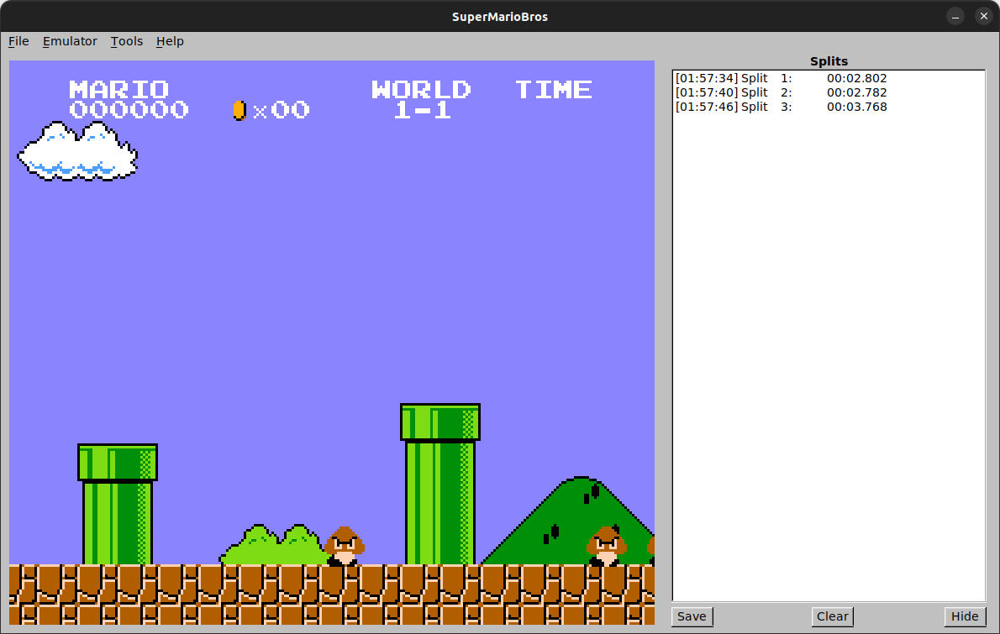
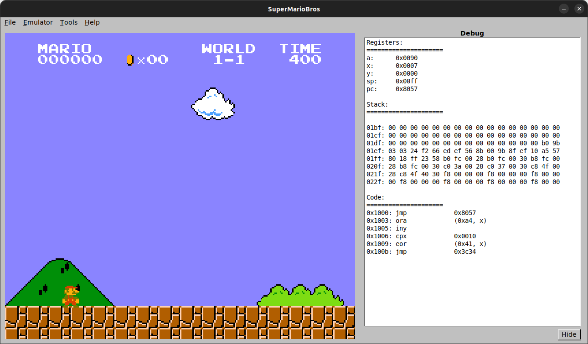

# hypr-nestopia - custom nestopia fork

This summarizes the customizations that have been made to the 0ldsk00l fork of Nestopia tha this fork originates
from.

## TODO

- [x] find a good way to display more split times on-screen
- [ ] write split times from current session to file at close/unload/reset
- [ ] expand config options reachable via GUI
- [ ] more user-friendly key-remapping interface for custom features

## Features
### Additional Quick Save/Load Slot Keyboard Hotkeys

Vanilla nestopia only provided hotkey mappings for slot 0 and 1; two more slots have been added
(slots 2 and 3) and mapped to hotkeys.

Keyboard mappings:

```ini
Load_slot0 = '1'
Load_slot1 = '2'
Load_slot2 = '3'
Load_slot3 = '4'

Save_slot0 = 'F5'
Save_slot1 = 'F6'
Save_slot2 = 'F7'
Save_slot3 = 'F8'
```

### Save/Load Slot Joystick Control Layer

_NOTE: requires a controller with at least 2 extra buttons available to map to the layer toggles_

A simple quick save/load controller layer has been implemented that can be used to trigger quick
save and load actions on 4 slots from a gamepad/controller.

The layers can be toggled with these controls by default:

```ini
qsave_layer_toggle = Right stick click
qload_layer_toggle = Left stick click
```

Once the desired layer is toggled, the A/B/X/Y cluster will be temporaily remapped to act as slot selectors for
slots 0,1,2, and 3, starting clockwise from the top.

```ini
slot0 = X
slot1 = A
slot2 = B
slot3 = Y
```

## Built-In Split Timer

A simple split timer has been built into the Emulator class in the Nestopia API core. The clock can
be toggled on and off, and each time it is toggled off the split time is calculated from the last
start time and displayed in a message on-screen. The split values are also saved to a vector in the
`SplitTimer` object.

### Controls

A toggle control has been created for both keyboard and joystick/gamepad. To use the timer, hit
the toggle once to start and then again to stop it and calculate the split time.

_NOTE: the timer doesn't automatically continue so in order to start a new split you need to toggle it back on after completing the last one._

```ini
Keyboard = 't'
Gamepad = 'Special bottom right'
```

### Splits GUI

A basic GUI view is available to display all splits recorded during a session. It can be found in
the menubar under _Tools>Time Splits_ (or with `Alt-w`).




## Debug View (WIP)

A debug view panel is available in the GUI and can be opened using the menu under _Tools>Debug View_ or `Alt-D`. It shows a live view of registers, some stack memory, and disassembly (wip).




## Reference: Controller Mapping: 8BitDo SN30Pro

Controls based on the 8BitDo SN30Pro wired USB controller, which presents itself as an Xbox 360
controller to the host.

```ini
# Possible values for joystick input:
#     j[joystick number][a|b|h][button/hat/axis number][1/0 = +/- (axes only)]
# Example: j0b3 = joystick 0, button 3. j1a11 = joystick 1, axis 1 + 1";

j0b0 = A
j0b1 = B
j0b2 = Y
j0b3 = X
j0b4 = L1
j0b5 = R1
j0b6 = select
j0b7 = start
j0b8 = special bottom right
j0b9 = left stick click
j0b10 = right stick click
```


---

# Original README
## About
This project is a fork of the original Nestopia source code, plus the 
Linux port. The purpose of the project is to make sure people who want
a standalone GUI for the Nestopia emulator have this option available.

Current Project Goals:
* Maintain a functional GUI for the Nestopia emulator on Linux, BSD, and Windows platforms

Contributing/Issues:
* Contributions will be reviewed for anything related to the standalone GUI builds
* Issues related to core emulation will be closed. This project no longer maintains the core emulator. Please submit issues about core emulation upstream at https://gitlab.com/jgemu/nestopia
* When not using a tagged release, please understand that the code is volatile and nothing is set in stone.

The following platforms are supported:
* Linux, BSD, Windows

Libretro notes:
The libretro port is no longer maintained in this repo, and is now maintained by the
libretro community. For libretro-specific issues, please use the libretro repository:
https://github.com/libretro/nestopia

This project depends on the following libraries:
FLTK 1.3, SDL2, libarchive, zlib

## Installing Dependencies
Install dependencies required for building on Debian-based Linux distributions:
```
apt-get install build-essential autoconf autoconf-archive automake autotools-dev libfltk1.3-dev libsdl2-dev libarchive-dev zlib1g-dev
```

## FLTK Build
To build using Autotools (optional arguments in square brackets):
```
autoreconf -vif
./configure [--enable-doc]
make
```
Optionally:
```
make install
```

## macOS Build
```
# Install dependencies
brew install autoconf automake autoconf-archive pkg-config libarchive libepoxy fltk

# Build
autoreconf -vif
export PKG_CONFIG_PATH=/usr/local/opt/libarchive/lib/pkgconfig/
./configure [--enable-doc]
make [install]
```

## Win32 Build
To build the win32 solution with Visual Studio 2010:
1. Ensure you have the DirectX 9 SDK
2. Manually zip NstDatabase.xml to the destination source/core/database/NstDatabase.zip
3. Open projects/nestopia.sln
4. Build in release mode
